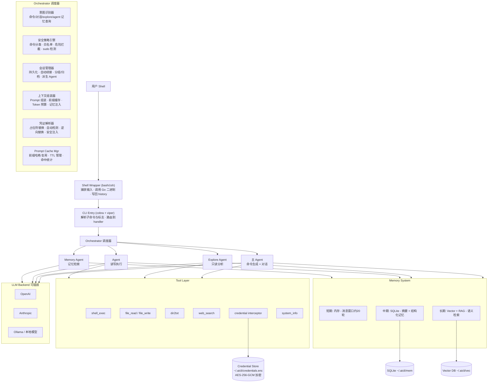
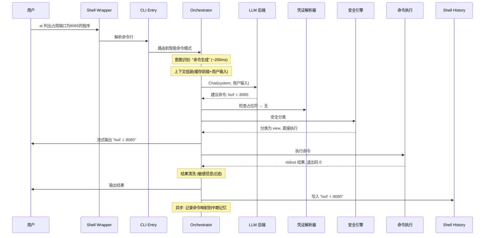
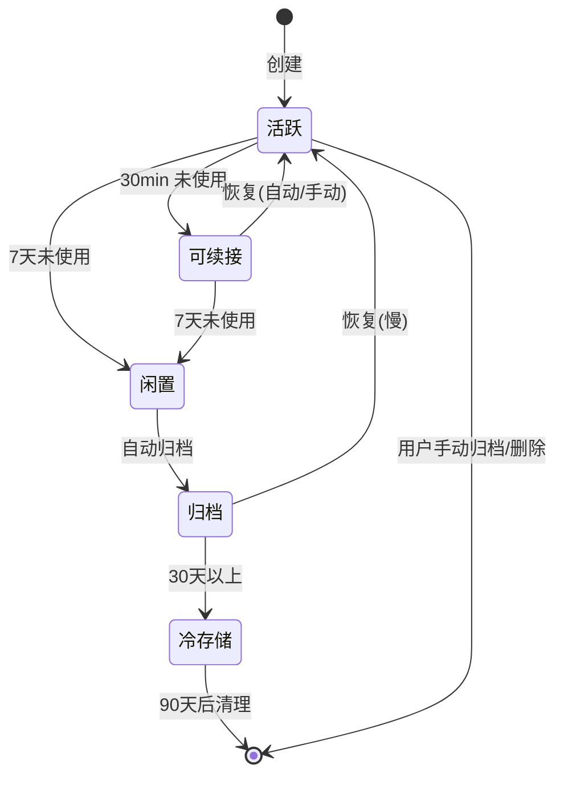
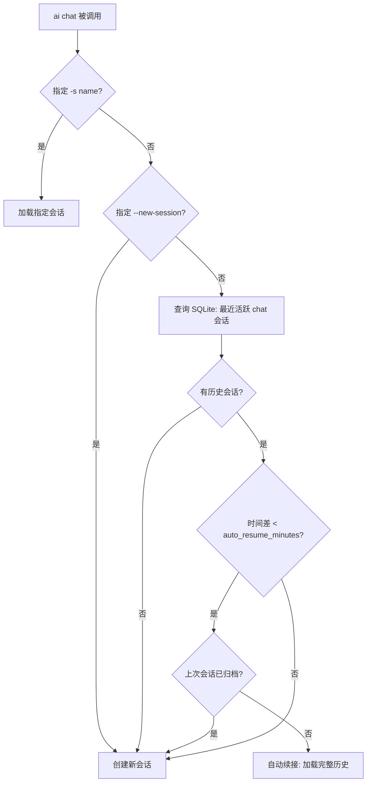
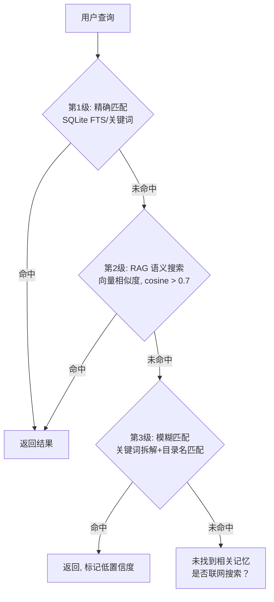
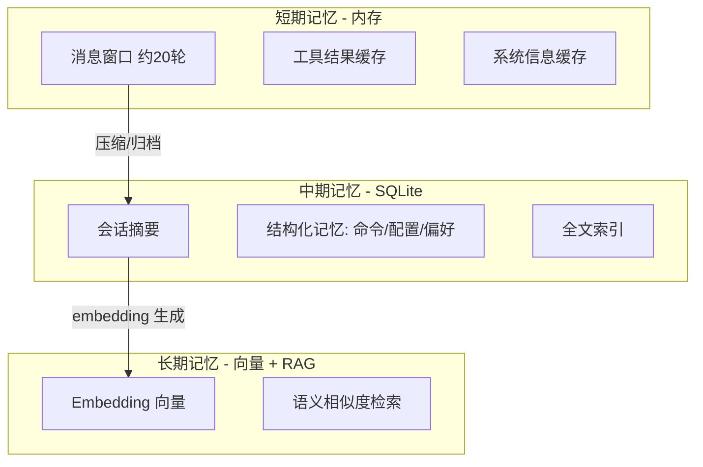
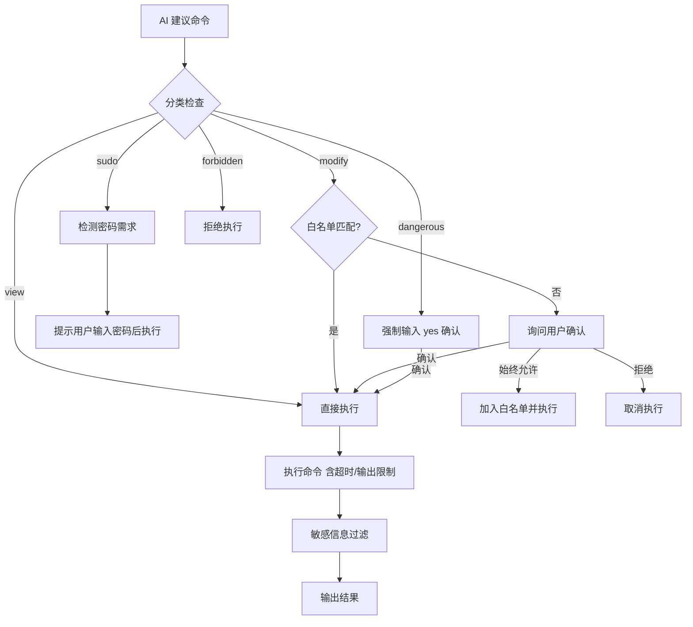
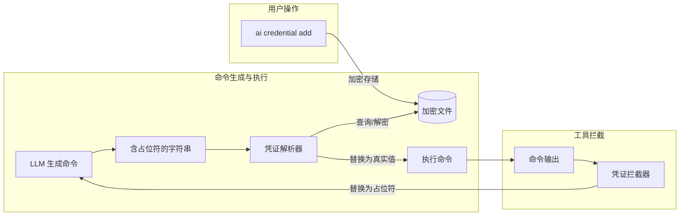
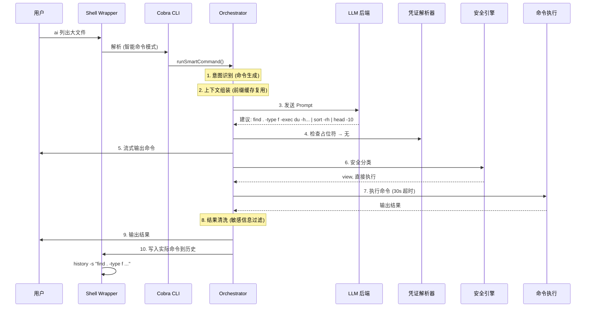

# `aicli` - 终端智能助手项目规划文档

> **版本**: 1.2
> **最后更新**: 2026-05-31
> **语言**: Go
> **目标平台**: Linux (主要), macOS (可扩展)
> **核心定位**: 命令为主 + 轻量开发 —— 非编程 IDE 工具，是终端命令辅助工具

---

## 1. 项目概述与愿景

`aicli` 是一个终端智能助手，命令行入口为 `ai` 或 `aicli`（两者等价，`aicli` 用于避免与其他工具命名冲突）。用户输入 `ai xxx`，AI 帮助生成/执行命令，替代记忆和手动输入。目标是将 AI 封装成一条原生命令，快速、简洁、无摩擦。

**核心理念**:
- 默认不啰嗦，给出最可能的命令或答案
- 纯查看类命令直接执行，无需确认
- 命令写入 shell 历史，按上键看到的是实际命令而非 `ai xxx`
- AI 渐进了解用户和机器，随使用越来越智能
- 会话持久化存储，不依赖进程存活，随时恢复对话
- AI 永不接触真实密钥，凭证通过占位符机制安全注入

---

## 2. 核心功能清单（按优先级排序）

### P0 - 最小可用版本
| 功能 | 说明 |
|------|------|
| 隐式命令推断 | `ai 查看内存` -> 直接生成并执行 `free -h` |
| 纯查看命令直接执行 | ls, cat, grep, ps, lsof, free, df 等无需确认 |
| 修改类命令确认机制 | rm, mv, chmod 等需要首次确认 |
| 流式输出命令 | 命令逐字出现，用户可感知进度 |
| Shell 历史替换 | 实际命令写进 shell 历史，上键可见 |
| 短期对话上下文 | 当前会话保留最近 20 轮对话 |

### P1 - 核心功能
| 功能 | 说明 |
|------|------|
| `ai chat` 模式 | 持续对话，会话持久化存储，自动续接 |
| 会话持久化与自动续接 | SQLite 存储，30min 窗口自动恢复，退出不丢失 |
| sudo 命令检测 | 自动识别需要提权的命令，提示用户输入密码 |
| 命令白名单 | 用户可将修改类命令加入白名单，之后直接执行 |
| 中期记忆 | SQLite 存储压缩摘要，会话间可检索 |
| Shell wrapper 函数 | `.bashrc` / `.zshrc` 集成 (ai/aicli 双入口) |
| Prompt 前缀缓存 | 系统信息/目录/记忆前缀复用，LLM API 缓存友好 |
| -v 详细模式 | 显示完整推理过程和工具调用链 |

### P2 - 进阶功能
| 功能 | 说明 |
|------|------|
| `ai explore` 子智能体 | 只读分析模式，独立上下文，从主会话派生 |
| `ai agent` 模式 | 可修改文件的独立 agent 环境 |
| 凭证管理系统 | 加密存储，占位符机制，AI 永不接触真实密钥 |
| 长期记忆 (RAG) | 向量检索，语义搜索 |
| 会话分组与归档 | 按话题分组，长时间不用自动归档 |
| 分级检索 | 精确匹配 -> RAG 语义搜索 -> 模糊匹配 |
| 配置管理 | `~/.aicli/config.yaml` 管理所有配置 |

### P3 - 增强功能
| 功能 | 说明 |
|------|------|
| `ai search` | 结合本地记忆与联网搜索 |
| `ai note` | 快速记录知识到长期记忆 |
| `ai memory` | 记忆管理：搜索、查看、导出、清理 |
| 项目感知 | 按工作目录自动加载项目相关记忆 |
| 审计日志 | 记录所有 AI 发起的命令及用户确认 |
| 渐进式披露 | AI 按需获取系统信息，不一次性全量加载 |

### P4 - 可选增强
| 功能 | 说明 |
|------|------|
| macOS 适配 | 检测系统差异，适配命令 |
| 多 LLM 后端 | 支持 OpenAI / Ollama / 本地模型 |
| 多 profile | 不同项目使用不同配置 |
| 多模态 | 图片/PDF 感知 (按需) |

---

## 3. 详细架构设计

### 3.1 整体架构图



### 3.2 各模块职责与边界

#### CLI Entry (cobra + viper)
- **职责**: 解析命令行参数，路由到对应的 handler
- **边界**: 只做解析和路由，不做业务逻辑
- **输入**: `os.Args`
- **输出**: handler 调用

#### Orchestrator (调度器) - 核心
- **意图识别器**:
  - 使用快速模式（非思考模式）判断用户输入属于哪种意图
  - 分类: 命令生成 / 纯对话 / explore / agent / 记忆查询
  - 命令生成路径下，再细分: 纯查看 / 修改类 / 需要sudo
- **安全策略引擎**:
  - 命令分类: 查看类 / 修改类 / 危险类
  - 白名单管理: 用户可添加常用命令为可信
  - sudo 检测: 识别命令是否需要提权
  - 危险操作拦截: 禁止 `rm -rf /` 等毁灭性操作
- **会话管理器**:
  - 持久化会话存储 (SQLite)，不依赖进程存活
  - 自动续接: 短时间内（默认 30min）再次调用 `ai chat`，自动接上上次会话
  - 超时自动新开会话（时间阈值可配置）
  - 手动指定会话: `ai chat -s session-name` 切换/恢复特定会话
  - 派生 Agent: explore/agent 从主会话派生，继承上下文但有独立对话窗口
  - 会话分组与归档
- **上下文组装器**:
  - Prompt 组装: 系统信息 + 记忆 + 当前上下文
  - **前缀缓存控制**: 分离静态前缀（系统信息、目录快照、记忆注入）与动态后缀（用户输入、最近对话），保证短时间内相同前缀可被 LLM API 的 prompt caching 命中
  - Token 预算控制: 确保不超出模型限制
  - 按优先级注入记忆: 短摘要 > 语义相关 > 目录快照
- **凭证解析器**:
  - 占位符替换: 将 AI 响应中的 `{{credential-id}}` 在执行前替换为真实密钥
  - 自动检测: 识别常见凭证模式（环境变量赋值、curl header 等），提示用户存储
  - 逆向替换: 工具返回值中的疑似密钥，替换为占位符后再送给 LLM
  - 安全注入: 执行命令时注入真实凭证，进程内存中短暂持有后立即清除
- **Prompt Cache Manager**:
  - 前缀哈希计算与复用: 短时间内未变化的系统信息/目录/记忆部分，复用上一次的 prompt 前缀
  - TTL 管理: 缓存有效期（默认 5min），超时后重新计算前缀
  - 缓存命中统计: 记录命中率，用于调试和优化

#### Agent 层
- **主 Agent**: 处理 `ai xxx` 隐式命令生成、`ai chat` 对话
  - 可以: 建议命令、执行命令、回答问题
  - 工具有: shell_exec, file_read, memory_query
- **Explore Agent**: `ai explore xxx` 只读分析
  - 可以: 读文件、执行只读命令、分析项目结构
  - 不可以: 修改任何文件
  - 工具有: shell_exec(readonly), file_read, dir2txt, web_search
- **Agent (读写)**: `ai agent xxx` 独立执行环境
  - 可以: 修改配置、安装软件、编辑文件
  - 需要: 每次写操作需确认
  - 工具有: shell_exec(full), file_read, file_write, web_search
- **Memory Agent**: 记忆查询与管理
  - 服务于其他 Agent 和用户的记忆检索请求

#### Memory System (记忆系统)
- 详见第 6 节

#### Tool Layer (工具层)
- shell_exec: 执行 shell 命令，返回 stdout/stderr 和退出码
- file_read: 读取文件内容 (限制大小)
- file_write: 写入文件 (仅 agent 模式)
- dir2txt: 调用外部工具扁平化目录结构
- web_search: 联网搜索 (通过 Tavily / Bing API)
- system_info: 获取系统信息 (OS、Shell、当前目录等)
- credential_lookup: 查询凭证标识符列表（仅返回标识符，不返回真实值）

#### LLM Backend (LLM 后端)
- 可插拔设计，支持 OpenAI API、Ollama、Anthropic API
- 接口统一: `Chat(messages, tools) -> response`

### 3.3 数据流

**典型流程 `ai 列出占用端口为8085的程序`:**



---

## 4. 命令设计

### 4.1 完整命令结构

```
ai [global flags] [command] [args...]

当未指定子命令时，自动进入"智能命令模式"：
  ai 查看CPU型号       → 生成命令并执行
  ai 为什么磁盘满了？    → 生成命令并执行

Commands:
  chat       进入持续对话模式（自动续接或新开会话）
  explore    启动只读探索子智能体
  agent      启动读写独立 agent
  search     搜索记忆或联网搜索
  note       记录知识到长期记忆
  memory     记忆管理（搜索/查看/导出/清理）
  config     管理配置
  credential 凭证管理（添加/列出/删除/测试）
  shell      安装/更新 shell 集成
  session    会话管理（列表/切换/归档/分组）

Global Flags:
  -v, --verbose         显示详细推理过程
  -q, --quiet           静默模式，仅输出结果
  -m, --model string    临时切换模型
  -s, --session string  指定会话名称（chat/explore/agent 均可用）
  --no-exec             只建议命令，不执行
  --no-history          不写入 shell 历史
  --dry-run             显示将执行的命令但不执行
  --new-session         强制新开会话（即使短时间内有活跃会话）

Aliases:
  ai s    → ai search
  ai n    → ai note
  ai e    → ai explore
  ai a    → ai agent
  ai c    → ai chat
```

### 4.2 各命令详细行为

#### 默认模式: 智能命令

```bash
# 纯查看命令 - 直接执行，无需确认
ai 列出占用端口8085的程序
→ lsof -i :8085 (流式显示)
→ [直接执行，输出结果]

# 修改类命令 - 首次需确认
ai 删除所有 .tmp 文件
→ find . -name "*.tmp" -delete
→ ⚠ 这是一个修改操作，是否执行？[y/N/a(始终允许)]
→ y: 执行     N: 取消     a: 加入白名单并执行

# sudo 命令 - 提示用户输入密码
ai 查看nginx配置
→ sudo cat /etc/nginx/nginx.conf
→ 🔒 需要管理员权限，请在终端输入密码:
→ [sudo 密码输入]
→ [输出结果]
```

#### ai chat - 持续对话

**自动续接规则**:
- 默认阈值: 30 分钟内再次调用 `ai chat`，自动恢复到上一次活跃的 chat 会话
- 阈值可通过 `context.session_auto_resume_minutes` 配置
- 若上次会话已被归档，则创建新会话
- 使用 `--new-session` 强制跳过自动续接

**对话模式交互示例**:
```
You: 为什么我的nginx启动失败了？
AI: 让我查看一下... [执行 sudo systemctl status nginx]
    nginx 启动失败，错误: port 80 already in use
    端口 80 被进程 PID 1234 (apache2) 占用
    建议: systemctl stop apache2 && systemctl start nginx
You: 帮我停掉apache
AI: [执行 sudo systemctl stop apache2] ✓ 已停止
You: exit / quit / Ctrl+C
→ 退出对话模式，会话已持久化保存
→ 下次 ai chat 将自动续接
```

**会话持久化**: 每次对话轮次即时写入 SQLite，不依赖进程存活。退出后会话状态保持为活跃，下次调用时从 SQLite 加载完整上下文。

**派生 Agent**: 在 chat 会话中可派生 explore/agent，继承主会话上下文摘要，但有独立对话窗口，消息不污染主会话。

#### ai explore - 只读探索

```bash
ai explore 这个项目为什么构建失败？
→ [启动只读子智能体]
→ Agent: 让我先看看项目结构...
  ├── [dir2txt 获取目录快照]
  ├── [cat Makefile]
  ├── [make 2>&1 捕获错误]
  └── 分析: 缺少 libssl-dev，请运行 sudo apt install libssl-dev
```

#### ai agent - 独立 agent (读写)

```bash
ai agent 帮我配置nginx反向代理到localhost:3000
→ [启动独立 agent，可修改文件]
→ Agent: 我将配置 /etc/nginx/sites-available/default
  ├── 检查现有配置
  ├── ⚠ 即将修改文件，是否继续？[y/N]
  └── 写入并测试通过
```

#### ai search - 搜索

```bash
ai search nginx 配置            # 搜索本地记忆
ai search --web "golang error"  # 联网搜索
ai search --all "数据库连接"     # 先本地，再联网
```

搜索流程: 精确匹配关键词 → 若无结果则 RAG 语义搜索 → 若无结果则联网搜索 (需 `--web`)

#### ai note - 记录知识

```bash
ai note "nginx 配置在 /etc/nginx/sites-enabled/default"
→ 记录到长期记忆 (含标签、目录、时间)
```

#### ai memory - 记忆管理

```bash
ai memory search "nginx"         # 搜索记忆
ai memory list                   # 列出所有记忆
ai memory show <id>              # 查看记忆详情
ai memory delete <id>            # 删除记忆
ai memory export --format json   # 导出记忆
ai memory clean --older-than 30d # 清理旧记忆
ai memory stats                  # 记忆统计信息
```

#### ai config - 配置管理

```bash
ai config show                   # 显示当前配置
ai config set model gpt-4o       # 设置模型
ai config set api-key sk-xxx     # 设置 API key
ai config reset                  # 恢复默认配置
```

#### ai credential - 凭证管理

**使用场景**:
- AI 生成命令时自动使用占位符: `export OPENAI_API_KEY={{my-openai-key}}`
- 系统执行时自动替换为真实密钥，AI 从未接触真实值
- curl 请求中自动注入: `curl -H "Authorization: Bearer {{github-token}}" ...`

**自动检测与提示**: 当 AI 生成的命令中包含可识别的凭证模式（环境变量赋值、curl header 等），系统自动提示用户是否存储。

#### ai session - 会话管理

```bash
ai session list                  # 列出所有会话
ai session switch <name>         # 切换会话
ai session new <name>            # 新建命名会话
ai session archive <name>        # 归档会话
ai session group <names...> --tag <tag>  # 会话分组
ai session delete <name>         # 删除会话（含记忆）
ai session summary <name>        # 查看会话摘要
```

---

## 5. 上下文与会话管理详细设计

### 5.1 会话生命周期



**状态定义**:
- **活跃**: 当前或最近 30 分钟内使用的会话，再次调用 `ai chat` 自动续接
- **可续接**: 30 分钟到 7 天未使用的会话，可通过 `-s` 手动恢复
- **闲置**: 1 小时到 7 天未使用的会话，保留完整上下文
- **归档**: 7 天以上未使用，压缩为摘要，移入归档
- **冷存储**: 30 天以上，仅保留摘要和关键记忆，释放向量索引

### 5.2 会话数据结构

会话信息包括：唯一 ID、名称、类型（chat/explore/agent）、自动生成的描述、关键词、上下文（消息窗口、摘要、系统提示、工作目录等）、时间戳、状态、分组和父会话 ID、消息/令牌计数等。

### 5.3 会话自动续接机制

**核心原则**: 会话持久化在 SQLite 中，不依赖进程存活。每次 `ai chat` 调用时从存储中加载会话状态。



**配置**: `context.session_auto_resume_minutes` (默认 30min)，`context.session_auto_resume_enabled` (默认 true)

### 5.4 前缀匹配与 Prompt Cache 优化

**设计目标**: 利用用户操作的局部性——短时间内连续多次查询，系统信息、当前目录、上下文基本不变——尽可能保证 prompt 前缀匹配，让 LLM API 的 prompt caching 机制生效。

**Prompt 结构分层**:

| 层级 | 内容 | 变化频率 |
|------|------|----------|
| 前缀 (静态/缓存友好) | System Prompt、系统信息、当前目录快照、记忆注入、会话压缩摘要 | 短时间内通常不变 |
| 后缀 (动态) | 最近 N 轮对话、当前用户输入 | 每次请求变化 |

**缓存策略**: 对前缀计算 SHA256 哈希，相同且未过期（TTL 默认 5min）则复用。

**触发缓存失效的条件**: 目录切换、目录快照更新、新记忆注入、TTL 过期、会话切换

**LLM API Prompt Caching 注意事项**:
- OpenAI: 对超过 1024 token 的前缀自动生效
- Anthropic: 需显式标记 `cache_control` 断点，最多 4 个
- 缓存命中时，前缀 token 按 10%-25% 的价格计费

### 5.5 压缩策略

**触发条件**: 上下文窗口消息数超过 `max_history` (默认 20 轮)

**压缩流程**:
1. 取窗口外最早的 10 轮消息
2. 调用快速/便宜模型 (如 gpt-4o-mini) 生成摘要
3. 摘要包含: 关键对话话题、已执行操作、发现的问题、未解决的 todo
4. 摘要前保留 2 轮前缀上下文 (前置锚定)
5. 将摘要注入窗口顶部

### 5.6 分级检索机制



**命中频率排序**: 每次记忆被检索命中计数器 +1，高频记忆保持在主表，低频率移入归档表。

### 5.7 归档与清理策略

**自动归档**: 闲置超过 7 天 → 自动生成摘要 → 移入归档 → 释放向量索引

**冷存储**: 归档超过 30 天 → 保留摘要，删除原始消息

**清理**: 超过 90 天可配置完全删除

**会话分组**: 手动将多个会话绑定到同一标签，共享上下文检索

**时效标记**: `ephemeral` (临时，24h 后清理) vs `persistent` (持久)。一次性命令自动标记 ephemeral，长对话/explore/agent 自动标记 persistent。

---

## 6. 记忆系统详细设计

### 6.1 三层记忆架构



**生命周期**: 短期 → 进程存活期间 | 中期 → 持久化，按策略归档 | 长期 → 持久化，受向量库限制

### 6.2 SQLite 存储结构

**核心表**:
- **sessions**: 会话元数据 (ID, 名称, 类型, 状态, 分组, 时间戳等)
- **messages**: 原始消息 + 压缩摘要 (按 seq 排序重建对话窗口)
- **memories**: 结构化知识 (类型: command/config/preference/file_info/note, 标签, 命中次数, 重要性)
- **memories_fts**: FTS5 全文索引
- **dir_snapshots**: 目录快照 (用于去重)
- **command_whitelist**: 命令白名单
- **audit_log**: 审计日志

### 6.3 向量检索存储

**技术选型**: chromem-go (纯 Go 嵌入式向量库) 或 sqlite-vec 扩展

**检索流程**:
1. 用户查询 → 生成 embedding
2. 向量库搜索 top-K 相似向量 (cosine similarity)
3. 过滤: similarity < 0.5 丢弃
4. 按 `similarity * log(hit_count + 1)` 综合排序
5. 返回 top-N 结果作为上下文

### 6.4 渐进式积累

每次使用 ai 时自动积累:
- 命令执行成功 → 自动记录命令-结果映射
- 用户纠错 → 更新记忆权重
- 新文件/目录 → 检测变化，提示更新快照
- `ai note` → 用户主动记录，高重要性标记

---

## 7. Shell 集成详细设计

### 7.1 Wrapper 函数

- 在 `.bashrc` / `.zshrc` 中定义 `ai()` 和 `aicli()` 函数
- 函数调用 Go 二进制并传递 `--history-file` 参数，将实际执行的命令写入临时文件
- 随后使用 `history -s` 将实际命令写入 shell 历史
- 通过 `HISTCONTROL=ignorespace` 排除原始 `ai` 命令

### 7.2 历史记录处理

**替换模式 (默认)**: `ai 列出端口` → 历史中存储 `lsof -i :8085`

**配置选项**:
- `shell.history_mode`: replace | append | none
- `shell.keep_original`: 是否保留 `ai xxx` 在历史中

### 7.3 流式展示

- 命令逐字出现 (约 30-50ms/字)，模拟打字效果
- 命令完整显示后立即执行
- 结果直接输出，AI 可同时做简短总结

### 7.4 安装/卸载

```bash
ai shell install     # 安装 shell wrapper 到 .bashrc/.zshrc
ai shell uninstall   # 移除 shell 集成
ai shell status      # 检查集成状态
```

---

## 8. 安全设计

### 8.1 命令分类体系

| 类别 | 说明 | 处理方式 |
|------|------|----------|
| **view** | 纯查看命令 (ls, cat, grep, ps, free 等) | 直接执行 |
| **modify** | 修改类命令 (rm, mv, chmod, git commit, npm install 等) | 检查白名单，否则确认 |
| **sudo** | 需要提权的命令 | 检测并提示密码输入 |
| **dangerous** | 危险操作 (如 dd, rm -rf / 的部分变体) | 强制二次确认 |
| **forbidden** | 禁止执行 (如 rm -rf /) | 直接拒绝 |

分类通过内置模式匹配实现。

### 8.2 执行流程



### 8.3 路径安全

- 提取命令中所有路径参数，解析为绝对路径
- 检查是否在允许范围内 (/home/, /tmp/, /etc/, /var/log/)
- 检查符号链接攻击风险

### 8.4 敏感信息过滤

输出经过正则匹配过滤:
- API Keys (api_key, secret_key 等)
- Passwords
- Tokens (JWT, Bearer)
- Private keys

### 8.5 审计日志

每次 AI 发起的命令执行都记录: 命令内容、分类、用户是否确认、退出码、执行耗时、会话 ID。

### 8.6 凭证安全

**核心原则**: AI 模型永远不接触真实密钥值。

- 真实密钥仅在命令执行前由凭证解析器解密，注入后立即执行，执行完立即清除
- 绝不将真实密钥写入日志、审计记录或任何持久化存储
- 所有 AI 可调用工具的返回值在发送给 LLM 前必须经过凭证过滤器

---

## 9. 凭证管理系统

### 9.1 核心原则

**AI 永远不会接触到真实密钥。** 系统在所有与 AI 的交互边界上实施凭证隔离：
- AI 生成的命令中，真实密钥被替换为占位符 `{{credential-id}}`
- AI 的工具调用返回值中，疑似密钥被替换为占位符
- AI 只看到标识符形式的引用，永远不接触真实值

### 9.2 架构设计



### 9.3 存储安全

**主方案: 加密文件**
- AES-256-GCM 认证加密，防止篡改
- 主密钥通过 Argon2id 从用户口令派生（抗 GPU/ASIC 暴力破解）
- 文件权限强制 0600

**备选方案: 系统 keyring** (Linux: Secret Service API / macOS: Keychain)

**推荐**: 先用加密文件方案（零依赖），后续可扩展系统 keyring 适配器。

### 9.4 占位符机制

**格式**: `{{credential-id}}`

**替换流程**: AI 生成命令 → 正则匹配 `{{id}}` → 查询 CredentialStore → 替换为真实值 → 执行 → 立即清除内存

**工具返回值逆向替换**: 所有工具返回值先匹配已知凭证值替换为占位符，再匹配通用敏感模式替换为 `***REDACTED***`

### 9.5 自动检测模式

系统内置常见凭证模式，当 AI 生成的命令匹配时自动提示存储:
- **环境变量**: OPENAI_API_KEY, AWS_ACCESS_KEY_ID, GITHUB_TOKEN 等
- **curl header**: Authorization: Bearer, X-API-Key 等
- **配置文件**: password:, secret:, token: 等

**检测时机**: AI 生成命令后执行前；用户手动输入凭证相关命令时

### 9.6 AI 工具层面的拦截

对所有 AI 可见的工具返回值（shell_exec、file_read）进行清洗：匹配已知凭证值 → 替换为占位符；通用敏感模式 → 替换为 `***REDACTED***`

### 9.7 主密钥管理

**首次使用**: 设置主口令 → 凭证加密存储

**会话解锁**: 每个 shell 会话首次访问凭证时需要输入主口令 → 解锁后主密钥缓存在进程内存中 → 进程退出时自动清除

**可选**: 将主密钥缓存到系统 keyring (30min TTL)，避免频繁输入

### 9.8 安全考量

- **内存安全**: 真实密钥仅短暂存在，使用 memguard 或手动清零
- **Core dump 防护**: 生产环境禁用 core dump 或 mlock 锁定敏感内存页
- **TTL 清除**: 解密后 30 秒自动从内存清除
- **审计**: 凭证的添加、删除、使用均记录审计日志

---

## 10. 实现路线图

### 第一阶段: 最小可用版本 (MVP) -- 2-3 周

**目标**: `ai 查看xxx` 最简单形式，AI 生成命令并执行

**交付物**:
1. Go 项目骨架 (cobra + viper)
2. LLM 集成 (OpenAI API 单后端)
3. 命令分类与执行 (查看直接执行 / 修改确认 / sudo 检测)
4. Shell wrapper (bash/zsh + 历史替换)
5. 流式输出
6. 基础配置 (`~/.aicli/config.yaml`)

**验证**: `ai 查看内存` → `free -h` 直接执行 | `ai 创建test目录` → 询问确认 | `ai 查看nginx配置` → 提示密码

### 第二阶段: 上下文与记忆 -- 2-3 周

**目标**: AI 能记住对话，会话持久化不依赖进程

**交付物**:
1. SQLite 存储层 (消息持久化 + 会话管理)
2. 会话自动续接 (30min 窗口)
3. 短期上下文窗口 (最近 20 轮)
4. 压缩策略 (窗口溢出自动压缩)
5. `ai chat` 模式
6. 前缀缓存 (LLM API prompt caching 优化)
7. 中期记忆 (命令-结果记录 + 关键词检索)

**验证**: `ai chat` 多轮对话 → 退出 → 5min 后 `ai chat` 自动恢复

### 第三阶段: Explore & Agent -- 2-3 周

**目标**: 独立的只读探索和读写 agent 模式

**交付物**:
1. `ai explore` 子命令 (只读工具集 + 独立上下文)
2. `ai agent` 子命令 (读写工具集 + 写操作确认)
3. dir2txt 集成 (目录快照)
4. 会话分组 (explore/agent 关联主会话)

**验证**: `ai explore 为什么构建失败？` 独立分析不污染主会话 | `ai agent 帮我配置nginx` 创建文件需确认

### 第四阶段: 凭证管理系统 -- 1-2 周

**目标**: AI 永不接触真实密钥

**交付物**:
1. 加密存储 (AES-256-GCM + Argon2id)
2. `ai credential` CLI (添加/列出/删除/测试/导入)
3. 占位符解析与替换
4. 自动检测常见凭证模式
5. 工具拦截层 (返回值过滤)

**验证**: `ai credential add my-key` → `ai 用my-key调用API` → AI 只看到 `{{my-key}}`，系统自动替换

### 第五阶段: 长期记忆与 RAG -- 2-3 周

**目标**: 跨会话的语义记忆检索

**交付物**:
1. 向量存储 (chromem-go 或 sqlite-vec)
2. Embedding 生成 (OpenAI API 或本地 onnx 模型)
3. RAG 检索管线 (语义搜索 + 混合检索)
4. `ai note` 和 `ai search`
5. 归档与清理 (自动归档 + 冷热分离)
6. 渐进式披露

**验证**: `ai note "密码在~/db-pass.txt"` → 一周后 `ai search 数据库密码` 找到记忆

### 第六阶段: 增强与优化 -- 持续

联网搜索、多 LLM 后端 (Ollama)、macOS 适配、多 profile、性能优化、测试覆盖

---

## 11. 技术选型

### 11.1 核心框架

| 组件 | 推荐库 | 理由 |
|------|--------|------|
| CLI 框架 | `github.com/spf13/cobra` | Go 生态最成熟，支持子命令、标志、自动补全 |
| 配置管理 | `github.com/spf13/viper` | 与 cobra 同源，支持 YAML/JSON/ENV |
| 日志 | `go.uber.org/zap` | 高性能结构化日志 |
| 数据库 | `github.com/ncruces/go-sqlite3` | 纯 Go，无需 CGO，支持 FTS5 |

### 11.2 LLM 交互

| 组件 | 推荐库 | 理由 |
|------|--------|------|
| OpenAI | `github.com/sashabaranov/go-openai` | 最成熟 Go SDK，支持流式、工具调用、embedding |
| Anthropic | `github.com/anthropics/anthropic-sdk-go` | 官方 SDK |
| Ollama | REST API | 支持本地模型 |
| 抽象层 | 自定义 `LLMClient` 接口 | 统一接口，方便切换后端 |

**统一接口**: `Chat(messages, tools) -> response` / `ChatStream(...)` / `Embed(texts) -> vectors`

### 11.3 向量检索

| 组件 | 推荐库 | 理由 |
|------|--------|------|
| 向量存储 | `github.com/philippgille/chromem-go` | 纯 Go，嵌入式，零依赖 |
| 备选 | `github.com/asg017/sqlite-vec` | SQLite 向量扩展 |
| Embedding API | OpenAI `text-embedding-3-small` | 托管服务，1536 维 |
| 本地 Embedding | onnxruntime + all-MiniLM-L6-v2 | 无需联网，384 维 |

**推荐**: 先用 OpenAI embedding API，后续按需切本地。

### 11.4 不推荐的库

| 库 | 理由 |
|----|------|
| `mattn/go-sqlite3` | 需要 CGO，跨平台编译复杂 |
| `langchaingo` | 太重，抽象过多 |
| `gpt4all` | 依赖重，不如直接用 Ollama API |

---

## 12. 项目结构建议

```
aicli/
├── cmd/aicli/main.go              # 入口
├── internal/
│   ├── cli/                        # cobra 命令 (root, chat, explore, agent, ...)
│   ├── orchestrator/               # 调度器核心 (意图, 上下文, 缓存, 凭证, 安全)
│   ├── agent/                      # Agent 实现 (main, explore, worker)
│   ├── memory/                     # 记忆系统 (sqlite, vector, 压缩, 检索)
│   ├── llm/                        # LLM 适配器 (openai, anthropic, ollama)
│   ├── tool/                       # 工具层 (shell, file, search, credential)
│   ├── credential/                 # 凭证管理 (store, resolver, detector)
│   └── config/                     # 配置管理
├── pkg/shell/                      # bash/zsh wrapper 模板
├── go.mod, Makefile, README.md
```

---

## 13. 配置文件示例

```yaml
# ~/.aicli/config.yaml

llm:
  provider: openai              # openai | anthropic | ollama
  model: gpt-4o
  fast_model: gpt-4o-mini       # 用于压缩摘要
  embedding_model: text-embedding-3-small
  api_key: ${OPENAI_API_KEY}
  max_tokens: 4096
  temperature: 0.0

shell:
  history_mode: replace         # replace | append | none
  keep_original: false
  auto_execute_view: true
  stream_output: true

context:
  max_history: 20               # 窗口大小 (轮)
  compress_threshold: 30        # 触发压缩阈值
  compress_keep_prefix: 2       # 压缩时保留前 N 轮
  session_auto_resume: true
  session_auto_resume_minutes: 30

prompt_cache:
  enabled: true
  ttl_minutes: 5
  track_hit_rate: true

memory:
  auto_record: true
  auto_snapshot: true
  archive_after_days: 7
  cold_after_days: 30
  clean_after_days: 90

security:
  sudo_auto_detect: true
  output_size_limit: 10240      # bytes
  exec_timeout: 30              # 秒
  sensitive_filter: true
  credential_auto_detect: true
  credential_ttl_seconds: 30

credentials:
  backend: file                 # file | keyring
  path: ~/.aicli/credentials.enc
  auto_lock_minutes: 30

whitelist:
  - "git push*"
  - "git commit*"
  - "npm install*"
  - "pip install*"
  - "make*"

forbidden:
  - "rm -rf /*"
  - "dd if=* of=/dev/*"
  - ":(){ :|:& };:"

display:
  style: auto                   # auto | plain | rich
  color: true
  show_tokens: false
  show_cost: false
```

---

## 14. 附录: 命令执行完整流程



---

*本文档随项目演进持续更新。*
